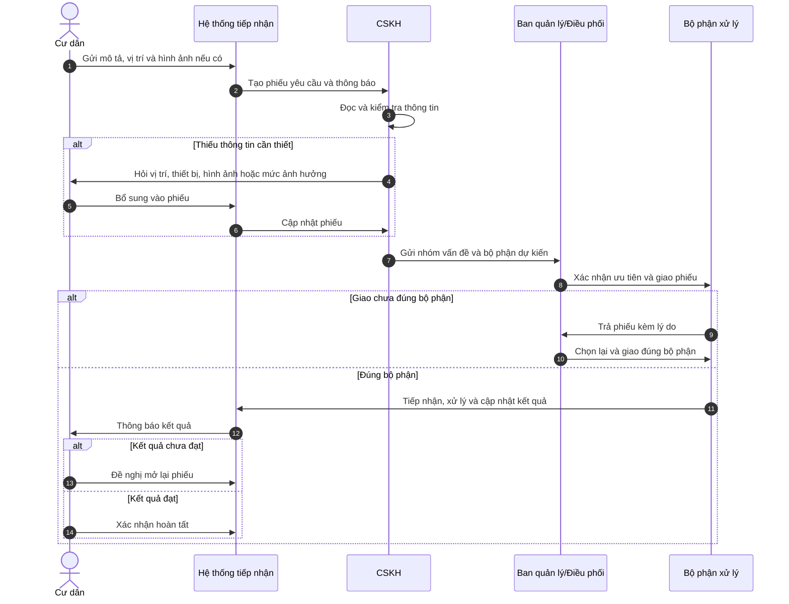
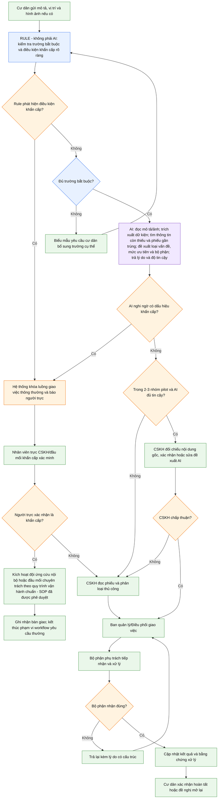

# 02 — Group Problem Statement (Bản nộp nhóm)

> Làm chung 1 bản, mỗi thành viên copy vào repo cá nhân. Đi theo Phase 3 → 6 trong `01-worksheet.md`. Nhóm chỉ chọn **candidate problem** ở Phase 3, viết Problem Statement sau khi validate + vẽ workflow.

## Thành viên nhóm

| STT | Họ và tên | Mã học viên | Vai trò trong nhóm (VD: facilitator, workflow, research, writer) |
|-----|-----------|-------------|---------------------------------------------------------------|
| 1 |  Dương Minh Hiếu | 2A202602488 | Scanning tìm ý tưởng, thảo luận và chốt vấn đề chung |
| 2 |  Nguyễn Vũ Quang Anh | 2A202602805 | Research ý tưởng, vẽ workflow và phát triển candicates problems, làm báo cáo nhóm |
| 3 |  Vũ Quốc Bảo | 2A202602829 | Đóng góp ý tưởng, làm báo cáo nhóm, đánh giá vấn đề  |
| 4 |  Cao Văn Trường | 2A202602562 | Đóng góp ý tưởng, làm slide thuyết trình |
| 5 | Nguyễn Thị Chinh | 2A202602876 | Đóng góp ý tưởng, làm báo cáo, tìm các phương pháp sẵn có giải quyết vấn đề |

**Candidate problem nhóm chọn (1 câu):** Khi cư dân gửi yêu cầu dịch vụ không khẩn cấp bằng mô tả tự do, thông tin có thể thiếu và phiếu có thể bị chuyển qua nhiều bộ phận trước khi đến đúng đơn vị xử lý.


---

## Phase 3 — Group Convergence: từ 9-12 candidates về 1

### 3.1. Trình bày top 3 mỗi người (mỗi candidate 1-2 phút)

| # | Người đưa ra | Candidate problem | Người gặp vấn đề | Điểm nghẽn | Cảm nhận nhanh của nhóm |
|---|---|---|---|---|---|
| 1 |  Dương Minh Hiếu |  Lọc cảnh báo ảo trong hệ thống camera AI giám sát đăng nhập  | Nhân viên an ninh trực ca giám sát |  Thuật toán phán đoán tức thời chỉ dựa trên 1 khung hình đơn lẻ không có nhận thức về thời gian lưu lại | Actor rõ (an ninh trực ca), bottleneck kỹ thuật cụ thể (1 khung hình, không có time-window) — dễ so sánh Rule (thêm ngưỡng thời gian) với AI thật |
| 2 |  Dương Minh Hiếu |  Lệch đồng bộ giữa video stream và bounding box |  Khách xem trực tiếp giao diện web |  Thiếu cơ chế đồng bộ tại frontend dựa trên timestamp | Actor "khách xem web" hơi mơ hồ, đây thiên về bug kỹ thuật hơn là problem có actor bị ảnh hưởng rõ |
| 3 |  Dương Minh Hiếu |  Trích xuất gán nhãn tự động các đoạn video sự kiện lỗi |  Thực tập sinh computer vision |  Nhiều người tua video hàng trăm giờ để tìm vài chục giây lỗi rất tốn thời gian | Đau thật (tua hàng trăm giờ video) nhưng phạm vi hẹp, chỉ ảnh hưởng nội bộ team CV |
| 4 | Nguyễn Vũ Quang Anh | Khi cư dân gửi yêu cầu dịch vụ không khẩn cấp bằng mô tả tự do, thông tin có thể thiếu và phiếu có thể bị chuyển qua nhiều bộ phận trước khi đến đúng đơn vị xử lý | Cư dân; nhân viên CSKH; ban quản lý/điều phối; bộ phận xử lý | Nhiều vòng hỏi bổ sung hoặc trả lại/giao lại xảy ra trước khi đúng bộ phận tiếp nhận | Actor và handoff rõ, bottleneck lặp vòng dễ vẽ workflow 5-7 bước; khả năng tiếp cận log phản ánh vẫn phải xác minh |
| 5 |  Nguyễn Vũ Quang Anh | Workflow xử lý và điều phối hồ sơ bệnh nhân | Bệnh nhân nộp hồ sơ, hệ thống sử dụng AI để có thể trích xuất và kiểm tra tính hợp lệ của hồ sơ trước khi đưa tới nhân viên hoặc yêu cầu bệnh nhân bổ sung hồ sơ |  Việc xử lý thủ công 100% hồ sơ bệnh nhân sẽ làm cho việc xử lý hồ sơ bị chậm dẫn tới có rất nhiều người bệnh đợi chờ | Ý tưởng tốt nhưng đụng dữ liệu y tế nhạy cảm — khó validate nhanh trong 4 tiếng vì không thể xin dữ liệu thật dễ dàng |
| 6 |  Nguyễn Vũ Quang Anh |  Chuyển đổi học liệu cho người khiếm thị |  Người học khiếm thị; giáo viên/ người tạo tài liệu, chuyên gia accessibility  |  Nhân viên phải ocr thủ công và chỉnh sửa thông tin bài giảng bằng tay  | Actor nhân đạo, dễ gây thiện cảm, nhưng phạm vi hẹp (1 khâu OCR) và ít dữ liệu thật để đo tần suất |
| 7 |  Nguyễn Thị Chinh | Tài xế Green SM ca trước trả xe lúc cạn pin dẫn đến ca sau không có xe đi, ảnh hưởng doanh thu, khách hàng |  Tài xế ca sau | Tài xế ca sau phải đi tìm trạm và xếp hàng sạc xe vào đầu ca | Rõ ràng, đo được (thời gian tìm trạm sạc), nhưng thiên về vấn đề vận hành/logistics hơn là bài toán AI rõ nét |
| 8 |  Nguyễn Thị Chinh |  Nhân viên Green SM dò lịch sử ảnh để phân định vết xước cũ hay mới, có phải do va chạm hay không |  Nhân viên kiểm tra xe | Bước tra cứu và soi ảnh đối chiếu thủ công bằng mắt thường | Bottleneck cụ thể (đối chiếu ảnh thủ công) nhưng cần dữ liệu ảnh lịch sử thật — khó có trong lab |
| 9 |  Nguyễn Thị Chinh |  Khi kiểm tra an toàn vận doanh hàng ngày, tài xế Green SM điền form báo cáo tình trạng xe trên app  |  Tài xế |  Bước thao tác bấm tick chọn và gõ bàn phím thủ công 15–20 tiêu chí an toàn trên màn hình điện thoại | Đau nhưng khá đơn giản, khả năng chỉ cần Rule (mẫu form thông minh) chứ chưa chắc cần AI |
| 10 | Vũ Quốc Bảo | Người cao tuổi thường xuyên nhận cuộc gọi/tin nhắn giả danh ngân hàng/người thân, do hoảng loạn nên làm theo hướng dẫn chuyển tiền | Người cao tuổi | Không có ai xác minh cùng ngay lúc họ đang hoảng loạn | Impact tiềm năng nghiêm trọng, nhưng tần suất, nhóm người cụ thể và hành động sau cảnh báo chưa được validation |
| 11 |  Vũ Quốc Bảo |  Khách hàng gọi tổng đài hỏi lại hạn hợp đồng bảo hiểm dù thông tin đã có trong email xác nhận lúc ký  |  Khách hàng + nhân viên CSKH  |  Khách phải gọi vì không có kênh tự tra cứu, dù thông tin đã tồn tại sẵn  | Tốt nhưng đã có giải pháp Rule đơn giản (nhắc SMS) giải quyết phần lớn — độ "cần AI" thấp |
| 12 |  Vũ Quốc Bảo |  Nhân viên kế toán mới phải đọc lại toàn bộ thông tư 30-40 trang mỗi khi gặp nghiệp vụ lạ, vì không có bảng tóm tắt nội bộ  |  Nhân viên kế toán, đặc biệt người mới  |  Phải đọc toàn văn bản dù thực tế chỉ cần 1-2 điều khoản liên quan  | Tốt nhưng phạm vi nội bộ 1 phòng ban, ít tính lan tỏa/thuyết phục khi pitch trước lớp |
| 13 | Cao Văn Trường | Người chăn nuôi khó phát hiện sớm từng con lợn có hành vi bất thường vì phải quan sát thủ công nhiều đàn trong thời gian ngắn, khiến việc can thiệp và cách ly có thể bị chậm. | Người chăn nuôi | Việc quan sát bằng mắt các dấu hiệu như bỏ ăn, nằm nhiều, tụ đàn rồi so sánh với tình trạng thường ngày dễ bỏ sót thay đổi nhỏ, đặc biệt khi số lượng vật nuôi lớn. | Actor và bottleneck rõ; có thể xác định input là hình ảnh/video và output là cảnh báo, nhưng cần nhãn chuyên môn để validation |
| 14 | Cao Văn Trường | Điều phối logistics khó đánh giá chính xác nguy cơ một lô nông sản bị giảm chất lượng trong quá trình vận chuyển vì phải kết hợp thủ công nhiều thông tin như nhiệt độ, thời gian, độ chín và lịch sử vận chuyển. | Điều phối logistics hoặc nhân viên QA | Các  cảnh báo hiện tại thường dựa vào một ngưỡng nhiệt độ đơn giản, chưa kết hợp đầy đủ với loại hàng, độ chín và thời gian còn lại. | Ý hay nhưng cần kết hợp nhiều loại dữ liệu (nhiệt độ, thời gian, độ chín, lịch sử vận chuyển) — phức tạp  để làm trong thời gian lab |
| 15 | Cao Văn Trường | Trong quá trình tiếp nhận yêu cầu sửa chữa, service advisor mất thời gian chuyển mô tả lỗi không có cấu trúc của khách hàng thành thông tin kỹ thuật đầy đủ cho kỹ thuật viên, khiến khách bị hỏi lại và workflow sửa chữa bị chậm. | Service advisor | Advisor thường phải hỏi lại nhiều câu và tự chuyển ngôn ngữ đời thường thành các trường thông tin có cấu trúc. | Bottleneck cụ thể nhưng actor đơn lẻ (1 advisor), ít tính hệ thống |

### 3.2. Gom trùng / cluster (gom 9-12 ý thành 3-4 cụm)

| Cluster | Candidates included | Pattern chung | Ghi chú |
|---|---|---|---|
| A | #4 (phản ánh cư dân), #5 (hồ sơ bệnh nhân), #15 (mô tả lỗi khách → kỹ thuật), #9 (form an toàn xe – nhập liệu có cấu trúc thủ công) | Thông tin phải đi qua nhiều bên xử lý hoặc phải được người dùng tự cấu trúc hóa thủ công, thiếu bước điều phối/chuẩn hóa tự động, gây lặp vòng hoặc chậm | |
| B | #1 (lọc báo động giả camera), #2 (lệch đồng bộ video/bbox), #3 (gán nhãn video lỗi) | Hệ thống giám sát tự động đưa ra tín hiệu/cảnh báo chưa đáng tin, do thuật toán hoặc dữ liệu đầu vào chưa đủ ngữ cảnh (thời gian, đồng bộ) | |
| C | #13 (lợn bệnh), #14 (nguy cơ giảm chất lượng nông sản) | Khó phát hiện sớm dấu hiệu bất thường vì phải quan sát/kết hợp thủ công nhiều tín hiệu rời rạc, ngưỡng cảnh báo hiện tại quá đơn giản | |
| D (nếu có) | #10 (lừa đảo người cao tuổi), #6 (học liệu người khiếm thị), #11 (hạn hợp đồng bảo hiểm), #12 (kế toán tra cứu văn bản), #7 (trả xe cạn pin), #8 (dò ảnh vết xước) | Actor cần một thông tin/cảnh báo đúng lúc để hành động kịp thời, nhưng hiện tại thông tin đó bị trễ, thiếu, hoặc không được xác minh trước khi actor phải quyết định | |

### 3.3. Shortlist (giữ 2-3 bài trả lời được 7 câu hỏi worksheet)

| Candidate | Vì sao vào shortlist (2-3 ý) | Rủi ro / điều chưa rõ |
|---|---|---|
| Hoàn thiện thông tin và chuyển yêu cầu dịch vụ không khẩn cấp của cư dân đến đúng bộ phận | Actor, handoff và vòng lặp có thể mô tả rõ; có thể giới hạn ở 2-3 nhóm yêu cầu; có metric đo từ log nếu tiếp cận được dữ liệu đã ẩn danh | Chưa xác nhận quyền tiếp cận dữ liệu hoặc baseline; AI có thể phân sai và cần CSKH xác nhận trước khi giao |
| Hệ thống cảnh báo cuộc gọi, tin nhắn lừa đảo | Có dấu hiệu rõ ràng, không phải do suy đoán mà hiện hữu xung quanh tất cả mọi người. Bottleneck cụ thể. Impact nghiêm trọng. | Actor còn rộng chưa rõ nhóm cụ thể. Metric khó đo được trong thời gian ngắn |
| Hệ thống lọc báo động giả | Không chỉ đơn giản nhìn vào 1 tín hiệu lẻ mà còn giảm alert fatigue đánh giá theo xác xuất | Liệu có hoạt động tốt trong tình huống chưa từng gặp hay không Threshold bao nhiêu là hợp lí |

### 3.4. Score để đồng thuận (chấm 1-5, ép nói rõ vì sao cho 5 / cho 3)

| Candidate | Actor rõ | Workflow rõ | Pain có evidence | Impact đo được | Làm trong lab | So sánh R/W/A được | Nhóm hiểu domain | Tổng |
|---|---:|---:|---:|---:|---:|---:|---:|---:|
| Hoàn thiện thông tin và chuyển yêu cầu cư dân | 5 | 5 | 2 | 5 | 5 | 5 | 3 | **30** |
| Cảnh báo cuộc gọi/tin nhắn lừa đảo cho người cao tuổi | 4 | 3 | 2 | 3 | 3 | 4 | 3 | **22** |
| Lọc báo động giả từ hệ thống camera | 5 | 4 | 2 | 4 | 4 | 5 | 4 | **28** |

**Giải thích điểm mô phỏng:**

- Candidate yêu cầu cư dân được điểm 5 ở actor, workflow, impact và khả năng làm trong lab vì đã chỉ ra các vai trò, hai vòng lặp và metric có công thức. Điểm evidence chỉ là 2 vì chưa có phỏng vấn, survey hoặc log thật; điểm hiểu domain là 3 trung tính vì báo cáo chưa cho thấy thành viên nào trực tiếp vận hành quy trình này.
- Candidate lọc báo động giả có actor và cách so sánh Rule/Workflow/AI rõ, nhưng vẫn thiếu log cảnh báo và baseline nên evidence chỉ là 2. Candidate này xếp thứ hai trong bản chấm thử.
- Candidate lừa đảo có impact tiềm năng lớn nhưng workflow phản ứng, quyền truy cập dữ liệu cuộc gọi và metric ngăn thiệt hại chưa rõ trong phạm vi lab. Candidate vật nuôi không vào shortlist vì cần video, nhãn chuyên môn và người hiểu nghiệp vụ thú y để kiểm chứng.

**Candidate nhóm chọn (1 bài duy nhất):**

```text
Hoàn thiện thông tin và chuyển yêu cầu dịch vụ không khẩn cấp của cư dân đến đúng bộ phận xử lý.
```

**Vì sao chọn (4-5 câu):**

```text
Candidate xác định được các tác nhân và điểm bàn giao chính: cư dân, CSKH, ban quản lý/điều phối và bộ phận xử lý. Điểm nghẽn tập trung ở việc thông tin đầu vào chưa đủ và việc phân loại/chọn bộ phận chưa nhất quán, thay vì mô tả chung là “xử lý phản ánh chậm”. Phạm vi có thể giới hạn ở 2-3 nhóm yêu cầu không khẩn cấp phổ biến để thử nghiệm nhỏ. Hiệu quả có thể đo bằng tỷ lệ chuyển đúng lần đầu, thời gian đến đúng bộ phận và tỷ lệ phải hỏi bổ sung nếu nhóm tiếp cận được log đã ẩn danh. Candidate được chọn để đi tiếp vì có workflow và cách đo rõ nhất trong bản chấm thử, nhưng pain vẫn phải được xác nhận ở Phase 4.
```

**Vì sao KHÔNG chọn các candidate còn lại (mỗi bài 2-3 câu):**

```text
1. Cảnh báo lừa đảo cho người cao tuổi: Nhóm đánh giá impact có thể rất nghiêm trọng, nhưng actor còn rộng và hành động cần thực hiện sau cảnh báo chưa được giới hạn rõ. Việc đo “ngăn được lừa đảo” trong thời gian lab khó và dữ liệu cuộc gọi/tin nhắn có rủi ro riêng tư cao.

2. Phát hiện sớm vật nuôi có dấu hiệu bệnh: Workflow quan sát → phát hiện → xác minh → cách ly có thể mô tả được, nhưng pilot cần video đủ đại diện, nhãn của người có chuyên môn và tiêu chuẩn phân biệt bất thường với bệnh. Nhóm chưa có bằng chứng về quyền truy cập những dữ liệu và chuyên gia đó.

3. Lọc báo động giả camera: Đây là candidate mạnh và đứng thứ hai trong bảng chấm thử vì actor, bottleneck và metric kỹ thuật khá rõ. Nhóm tạm không chọn vì cần log cảnh báo/camera phù hợp để kiểm chứng, trong khi candidate yêu cầu cư dân cho phép phân tích đầy đủ hơn các handoff giữa nhiều tác nhân và so sánh Rule/Workflow/Agent trong cùng một bài.
```

**Disagreement (nếu có — ai lo gì, chốt ra sao):**

```text
Một hướng ý kiến ưu tiên bài cảnh báo lừa đảo vì hậu quả xã hội lớn; hướng khác đánh giá lọc báo động giả rõ dữ liệu kỹ thuật và dễ định nghĩa đúng/sai hơn. Ý kiến ủng hộ yêu cầu cư dân cho rằng candidate này thể hiện rõ actor, handoff, bottleneck và human boundary. Nhóm có thể chốt tạm candidate yêu cầu cư dân để đi tiếp, với điều kiện quay lại shortlist nếu validation không xác nhận có nhiều vòng hỏi bổ sung hoặc giao sai bộ phận.
```

## Phase 4 — Quick Validation + Research

### 4.1. Quick validation (ít nhất 1 cách: interview 2-3 người hoặc survey 5-10 người)


| Nguồn | Số người / mẫu | Tín hiệu xác nhận (kèm quote nguyên văn) | Tín hiệu phản bác | Nhóm sửa problem thế nào |
|---|---:|---|---|---|
| Interview giả lập với CSKH/điều phối/bộ phận xử lý | 3 vai trò giả lập; 0 người thật | **Quote giả lập – CSKH:** “Có phiếu chỉ ghi ‘đèn hỏng’ nhưng không có tòa, tầng hoặc ảnh, nên tôi phải hỏi lại trước khi chuyển.” **Quote giả lập – điều phối:** “Khó nhất là các việc nằm giữa hai đội; nếu giao chưa đúng, đội nhận trả lại rồi chúng tôi phải phân lại.” | **Quote phản bác giả lập – bộ phận xử lý:** “Khi phiếu đã có đúng vị trí thì chúng tôi thường nhận đúng; thời gian lâu hơn chủ yếu là lúc chờ vật tư.” | Nếu tín hiệu này được xác nhận, giữ bottleneck ở khâu hoàn thiện thông tin/phân luồng và loại thời gian chờ vật tư khỏi impact của AI. Nếu ý kiến phản bác chiếm ưu thế, thu hẹp hoặc đổi problem. |
| Survey giả lập với cư dân từng gửi yêu cầu | 5 phản hồi giả lập; 0 phản hồi thật | **3/5 phản hồi giả lập** cho biết từng phải bổ sung vị trí/ảnh hoặc giải thích lại. **Quote minh họa:** “Tôi báo khu vực chung chưa được vệ sinh nhưng sau đó vẫn phải nhắn lại vị trí cụ thể.” | **2/5 phản hồi giả lập** cho biết không phải giải thích lại. **Quote minh họa:** “Tôi chọn đúng danh mục nên phiếu được nhận ngay; điều tôi thiếu là thông tin khi nào sẽ xử lý xong.” | Nếu kết quả thật tương tự, tách hai pain: (1) thiếu thông tin/phân luồng và (2) thiếu minh bạch trạng thái. Chỉ pain thứ nhất nằm trong scope AI hiện tại. |
| Log/phiếu yêu cầu đã ẩn danh | 0 phiếu hiện có; mục tiêu tối thiểu 100 phiếu thuộc cùng 2-3 nhóm | Cần đo được phiếu giao sai, số lần hỏi bổ sung và dấu thời gian đến bộ phận xử lý cuối | Nếu log thiếu lịch sử chuyển trạng thái, không xác định được bộ phận cuối hoặc tỷ lệ sai quá thấp để tạo khác biệt | Chỉ giữ metric có thể tính từ dữ liệu thật; nếu không có log, pilot chỉ dừng ở thử nghiệm usability và không tuyên bố giảm thời gian |

**Insight sau validation (1-2 câu — pain thật nằm ở đâu):**

```text
Các quote mô phỏng gợi ý pain có thể nằm ở thông tin ban đầu chưa đủ và các vòng trả lại/giao lại trước khi đúng bộ phận tiếp nhận. Tuy nhiên, quote phản biện cũng cho thấy thời gian chậm sau tiếp nhận có thể đến từ vật tư hoặc lịch xử lý; vì vậy Problem Statement chỉ quy tác động cho khâu hoàn thiện thông tin và phân luồng, không tuyên bố AI rút ngắn toàn bộ thời gian sửa chữa.
```

Bằng chứng đính kèm (nếu có): `02-group-problem-statement-survey.png`, `...-interview-notes.md`

### 4.2. Research giải pháp đã có (ít nhất 2-3 tools/patterns + 1-2 link kiểm được)

| Nguồn / tool / case | Link | Họ giải quyết bước nào? | Điểm mạnh | Khoảng trống / rủi ro | Bài học cho nhóm |
|---|---|---|---|---|---|
| AppFolio Smart Maintenance | [AppFolio Engineering — Smart Maintenance Conversational AI](https://engineering.appfolio.com/appfolio-engineering/2023/3/8/smart-maintenance-conversational-ai) | Tiếp nhận hội thoại, hỏi tiếp để xác định vấn đề/độ khẩn cấp, chuyển câu trả lời thành dữ liệu có cấu trúc và tạo work order | Rất gần domain quản lý cư dân; mô tả được chuỗi từ intake đến work order và vẫn có vai trò review/điều phối của con người | Là tài liệu của nhà cung cấp, không chứng minh cùng hiệu quả trong bối cảnh Việt Nam; cách xử lý khẩn cấp và quyền tự động dispatch phải theo SOP từng đơn vị | Có thể dùng AI để hỏi bổ sung và cấu trúc hóa đầu vào, nhưng phải giữ lịch sử hội thoại, handoff và quyền quyết định của người vận hành |
| ServiceNow Task Intelligence — Record Categorization | [ServiceNow Docs — Record categorization](https://www.servicenow.com/docs/r/xanadu/customer-service-management/case-categorization-overview.html) | Dùng mô hình ML đọc text và attachment để dự đoán trường phân loại; hiển thị các giá trị được dự đoán/đề xuất cho nhân viên và lưu feedback về dự đoán | Cho thấy pattern “AI đề xuất trường dữ liệu + người dùng chọn/sửa”; hỗ trợ attachment và có log kết quả dự đoán | Là nền tảng customer service chung, không có taxonomy cư dân sẵn; tự động route khi phân loại sai vẫn tạo rủi ro | Màn hình pilot nên hiển thị đề xuất cạnh nội dung gốc, cho CSKH sửa và lưu predicted value/final value để đo tỷ lệ đúng lần đầu |
| Zendesk Intelligent Triage | [Zendesk Help — Custom topics for intelligent triage](https://support.zendesk.com/hc/en-us/articles/8718789695002-Personalizing-intelligent-triage-by-creating-custom-topics) | AI phân loại ticket theo topic, language và sentiment; cho phép tạo topic/category/subcategory riêng cho nghiệp vụ | Nhấn mạnh taxonomy tùy biến và khuyến nghị tên topic rõ, mô tả cụ thể, tránh chồng lấn | Không trực tiếp giải quyết ảnh, vị trí hoặc quy trình ứng cứu; tính năng và dữ liệu phụ thuộc cấu hình/tài khoản | Trước khi huấn luyện hoặc prompt AI, nhóm phải chuẩn hóa 2-3 nhóm vấn đề và quy tắc phân biệt; taxonomy chồng lấn sẽ làm metric routing khó diễn giải |

**Research takeaway (2-3 câu — nên build gì / không build gì):**

```text
Ba nguồn cho thấy một pattern chung có thể áp dụng: chuẩn hóa taxonomy trước, dùng AI để đọc đầu vào tự do và tạo đề xuất có thể kiểm tra, sau đó lưu quyết định cuối của người vận hành để đánh giá. Nhóm nên thử một Workflow nhỏ cho 2-3 nhóm yêu cầu gồm Rule kiểm tra trường bắt buộc → AI trích xuất/hỏi bổ sung/đề xuất → CSKH xác nhận → điều phối giao việc; đồng thời so với baseline chỉ dùng biểu mẫu + Rule. Chưa nên build Agent tự giao, tự kích hoạt ứng cứu hoặc tự đóng phiếu, vì nghiên cứu sản phẩm không thay thế validation tại đơn vị và báo cáo chưa có dữ liệu chứng minh mức an toàn của các hành động tự động đó.
```

> Lưu ý: không dùng số liệu AI đưa nếu không verify được link chính thức. Ghi rõ giả định chưa chắc.

---

## Phase 5 — Workflow + Problem Statement

### 5.1. Current workflow bản nhóm

Dán workflow hoặc link file: `02-group-problem-statement-workflow.png/pdf/md`

```text
| [1 Cư dân tạo phiếu] → [2 CSKH kiểm tra] → [3 Hỏi bổ sung nếu thiếu] → [4 CSKH phân loại] → [5 Điều phối giao việc] → [6 Bộ phận nhận, trả lại nếu giao sai hoặc xử lý nếu đúng] → [7 Cư dân xác nhận/đề nghị mở lại] |
| :---- |
```



| Bước | Actor | Input | Output | Thời gian / tần suất | Ghi chú (handoff? bottleneck?) |
| :---- | :---- | :---- | :---- | :---- | :---- |
| 1. Tạo phiếu | Cư dân | Mô tả tự do; vị trí, hình ảnh nếu có | Phiếu có mã, thời điểm gửi và thông tin ban đầu | Mỗi khi phát hiện vấn đề; thời gian thao tác chưa đo | Bắt đầu đo thời gian từ dấu thời gian gửi phiếu. |
| 2. Kiểm tra thông tin | Nhân viên CSKH | Phiếu mới | Kết luận đủ hoặc thiếu thông tin | Mỗi phiếu; thời gian đọc chưa đo | Điểm nghẽn thứ nhất: tiêu chí “đủ” có thể chưa nhất quán. |
| 3. Hỏi và nhận bổ sung | CSKH và cư dân | Danh sách thông tin còn thiếu | Phiếu được bổ sung | Chỉ xảy ra khi thiếu; số vòng và thời gian chờ chưa đo | Handoff hai chiều; có thể lặp nhiều vòng. |
| 4. Phân loại sơ bộ | Nhân viên CSKH | Phiếu đã đủ thông tin | Nhóm vấn đề, mức ưu tiên và bộ phận dự kiến | Mỗi phiếu đủ thông tin; chưa đo | Phụ thuộc cách hiểu mô tả và bảng phân công hiện có. |
| 5. Xác nhận và giao việc | Ban quản lý/điều phối | Kết quả phân loại sơ bộ | Phiếu được giao cho một bộ phận | Mỗi lần giao hoặc giao lại; chưa đo | Handoff từ tiếp nhận sang thực thi. |
| 6. Kiểm tra và xử lý | Bộ phận kỹ thuật, vệ sinh hoặc cảnh quan phù hợp | Phiếu được giao | Tiếp nhận và kết quả xử lý, hoặc phiếu trả lại kèm lý do | Mỗi phiếu; thời gian xử lý hiện trường chưa đo | Điểm nghẽn thứ hai: giao sai tạo vòng quay lại bước 5. |
| 7. Kiểm tra kết quả | Cư dân | Thông báo và kết quả xử lý | Xác nhận hoàn tất hoặc yêu cầu mở lại | Sau khi phiếu được báo hoàn thành; theo dõi mở lại trong 7 ngày | Tỷ lệ mở lại là chỉ số kiểm soát chất lượng. |

**Bottleneck chính (2-3 câu):**

```text
| Điểm nghẽn nằm trong đoạn từ kiểm tra thông tin đến giao đúng bộ phận: mô tả ban đầu có thể thiếu, còn cách phân loại và chọn bộ phận có thể chưa nhất quán. Hai vấn đề này tạo vòng hỏi lại cư dân hoặc vòng trả phiếu/giao lại, kéo dài thời gian trước khi đơn vị thực sự chịu trách nhiệm tiếp nhận. Chưa có dữ liệu để kết luận phần chậm sau khi tiếp nhận là do quy trình phân luồng hay do nhân lực, vật tư hoặc phê duyệt của bộ phận xử lý. |
```

### 5.2. Future workflow bản nhóm

Phải nhìn ra 5 thứ: bước nào máy (Rule), bước nào AI, bước nào người, boundary ở đâu, fallback khi AI sai.

```text
| [1 Cư dân nhập yêu cầu] → [2 Rule kiểm tra trường bắt buộc và điều kiện khẩn cấp rõ ràng] → [3 AI đọc nội dung tự do, trích xuất và tạo đề xuất] → [4 Nếu Rule/AI phát tín hiệu khẩn cấp: người trực xác minh và kích hoạt quy trình vận hành chuẩn (SOP)] / [Nếu là yêu cầu thường: CSKH xác nhận] → [5 Điều phối giao việc] → [6 Bộ phận xử lý] → [7 Cư dân xác nhận]. 

Fallback: ngoài phạm vi, dữ liệu lỗi hoặc AI không đủ tin cậy → CSKH phân loại thủ công. |
```




**Công việc cụ thể của AI:**

| AI nhận gì? | AI làm gì? | AI trả ra gì? | AI không được tự làm gì? |
| :---- | :---- | :---- | :---- |
| Nội dung và hình ảnh trong phiếu; vị trí/thời điểm đã được phép dùng; danh mục vấn đề và bảng phân công đã duyệt; các phiếu lịch sử đã ẩn danh nếu có quyền truy cập | (1) Trích xuất vị trí, thiết bị, loại sự cố và mức ảnh hưởng được nhắc đến; (2) chỉ ra thông tin nghiệp vụ còn thiếu và soạn câu hỏi bổ sung; (3) tìm phiếu gần trùng; (4) đề xuất loại vấn đề, mức ưu tiên và bộ phận; (5) phát tín hiệu “nghi ngờ khẩn cấp”; (6) gắn lý do và độ tin cậy cho từng đề xuất | Các trường dữ liệu có dẫn chiếu về nội dung gốc; danh sách thông tin thiếu; các phiếu gần trùng; bộ phận/mức ưu tiên đề xuất; cờ nghi ngờ khẩn cấp; lý do và độ tin cậy | Không xác nhận tình huống khẩn cấp; không tự liên hệ đội ứng cứu; không tự giao hoặc đóng phiếu; không quyết định nguồn lực, chi phí hay kết quả xử lý hiện trường |

**Nhánh khẩn cấp và người chịu trách nhiệm:**

1. Rule phát hiện điều kiện rõ ràng hoặc AI phát tín hiệu nghi ngờ thì hệ thống phải giữ phiếu ngoài luồng giao việc thông thường và báo cho **nhân viên trực CSKH/đầu mối khẩn cấp**.
2. Người trực đọc nội dung gốc, liên hệ lại khi phù hợp và xác nhận đây là khẩn cấp hay cảnh báo nhầm. AI chỉ hỗ trợ phát hiện, không ra quyết định cuối.
3. Nếu xác nhận khẩn cấp, người trực kích hoạt **đội ứng cứu nội bộ hoặc đầu mối chuyên trách** theo quy trình vận hành chuẩn (SOP) đã được đơn vị vận hành phê duyệt; phần ứng cứu nằm ngoài scope của bài toán phân luồng yêu cầu thường.
4. Nếu cảnh báo nhầm, người trực ghi lý do và đưa phiếu trở lại nhánh CSKH phân loại thủ công.
5. Báo cáo chưa có SOP của một khu dân cư cụ thể, nên tên đầu mối, kênh liên lạc, thời hạn phản hồi và đơn vị ứng cứu tương ứng **chưa được xác minh và không được tự điền**. Nhóm phải hỏi đơn vị vận hành trước khi pilot.

**Phân quyền và fallback:**

- Trong pilot, CSKH là điểm kiểm soát bắt buộc trước khi giao mọi phiếu thường. Màn hình review phải đặt đề xuất AI cạnh nội dung/ảnh gốc để người kiểm tra không phê duyệt theo quán tính.
- Nếu AI ngoài phạm vi, độ tin cậy thấp, ảnh không đọc được, dữ liệu xung đột hoặc hệ thống lỗi, CSKH bỏ qua đề xuất và phân loại thủ công.
- Bộ phận xử lý có quyền trả lại phiếu, nhưng phải chọn lý do có cấu trúc để đo lỗi phân luồng và cập nhật bảng phân công sau khi có người phê duyệt.
- AI không tự học trực tiếp từ mỗi lần CSKH sửa; dữ liệu sửa chỉ được dùng để đánh giá/cập nhật sau khi được kiểm tra và phê duyệt.

**Before/after impact:**

| Metric | Trước | Sau kỳ vọng | Cách đo |
|---|---:|---:|---|
| Thời gian đến đúng bộ phận | T0 chưa đo | Giảm ít nhất 40% so với trung vị T0 | `thời điểm bộ phận xử lý cuối cùng tiếp nhận − thời điểm cư dân gửi`; so sánh cùng nhóm vấn đề và cùng khung vận hành. |
| Số bước | 7 bước danh nghĩa, có thể lặp bước 3 hoặc 5-6 | Vẫn 7 bước danh nghĩa nhưng giảm số vòng hỏi lại/giao lại | Đếm số sự kiện chuyển trạng thái và số lần phiếu quay lại bước trước. |
| Số bước thủ công | Chưa có log để xác định chính xác | Rule/AI hỗ trợ kiểm tra và phân loại; con người vẫn xác nhận, giao việc và xử lý | Ghi thao tác người dùng theo từng phiếu; không suy ra từ sơ đồ. |
| Bottleneck chính | Thiếu thông tin và giao sai bộ phận | Chuyển sang bước CSKH kiểm tra các trường hợp ngoại lệ/độ tin cậy thấp | Đo thời gian chờ ở từng trạng thái và số phiếu cần CSKH sửa đề xuất. |
| Risk mới | Chưa có rủi ro do mô hình AI | AI trích sai, đề xuất sai bộ phận, bỏ sót dấu hiệu khẩn cấp hoặc lộ dữ liệu cá nhân | Audit mẫu phiếu; ghi đầy đủ đề xuất, sửa đổi của CSKH và kết quả giao cuối. Trường hợp khẩn cấp bị đưa vào luồng thường phải bằng 0. |

### 5.3. Problem Statement v0 (mỗi field 2-3 câu)

| Field | Nội dung |
|---|---|
| **Actor** | Cư dân là người tạo yêu cầu và chịu thời gian chờ; nhân viên CSKH cùng ban quản lý/điều phối là những người kiểm tra, phân loại và bàn giao phiếu. Bộ phận kỹ thuật, vệ sinh hoặc cảnh quan là đơn vị tiếp nhận và xử lý cuối cùng. |
| **Workflow** | Khi phát hiện vấn đề không khẩn cấp tại khu dân cư, cư dân tạo phiếu bằng mô tả tự do, vị trí và hình ảnh nếu có. CSKH kiểm tra và hỏi bổ sung, phân loại sơ bộ; ban quản lý/điều phối giao việc; bộ phận nhận kiểm tra, xử lý hoặc trả lại; cư dân xác nhận hoàn tất hoặc mở lại. |
| **Bottleneck** | Thông tin ban đầu có thể chưa đủ để hành động và việc chọn nhóm vấn đề/bộ phận có thể chưa nhất quán. Vì vậy phiếu có thể trải qua nhiều vòng hỏi bổ sung hoặc giao lại trước khi đến đúng bộ phận. |
| **Impact** | Tăng thời gian từ lúc cư dân gửi đến lúc đúng bộ phận tiếp nhận, tăng công đọc và chuyển phiếu của CSKH/điều phối, đồng thời buộc cư dân giải thích lại. Chưa có baseline nên báo cáo chưa khẳng định quy mô thiệt hại hoặc số phút tiết kiệm thực tế. |
| **Success Metric** | Đo T0 trên tối thiểu 100 phiếu đã ẩn danh thuộc cùng 2-3 nhóm vấn đề: tỷ lệ chuyển đúng lần đầu, trung vị thời gian đến đúng bộ phận, tỷ lệ phải hỏi bổ sung và tỷ lệ mở lại trong 7 ngày. Mục tiêu thử nghiệm đề xuất là tăng tỷ lệ đúng lần đầu ít nhất 20 điểm phần trăm, giảm thời gian ít nhất 40%, giảm tỷ lệ hỏi bổ sung ít nhất 30%, không làm tỷ lệ mở lại cao hơn T0 và không để trường hợp khẩn cấp nào vào luồng thường. |
| **Boundary** | Chỉ xem xét khâu hoàn thiện thông tin và phân luồng 2-3 nhóm yêu cầu dịch vụ không khẩn cấp. Không xử lý cháy nổ, y tế hoặc an ninh khẩn cấp; không tối ưu nhân lực/vật tư, không thay quyết định nghiệp vụ của bộ phận xử lý và không cho AI tự giao hoặc tự đóng phiếu trong pilot. |

**Câu hỏi AI phản biện v0 (nếu có):**

* Field nào mơ hồ: “xử lý phản ánh chậm” chưa chỉ ra chậm trước hay sau khi đúng bộ phận nhận; “chuyển đúng” chưa có mốc thời gian và mẫu số; actor ban đầu gộp nhiều vai trò; mục tiêu AI dễ lẫn với mục tiêu sửa chữa hiện trường.
* Tôi sửa gì: tách các handoff, xác định thời điểm kết thúc là lúc bộ phận xử lý cuối cùng tiếp nhận, mô tả công thức đo và giới hạn AI ở khâu hoàn thiện thông tin/phân luồng có CSKH xác nhận.

---

## Phase 6 — Rule / Workflow / Agent + Decision

### 6.0. Ma trận độ phù hợp (suy nghĩ nhanh, không thay quyết định cuối)

**Đánh giá hai tiêu chí**

| Tiêu chí | Thấp | Cao | Căn cứ đánh giá |
|---|:---:|:---:|---|
| **Độ mơ hồ** | ☐ | ☑ | Mô tả tự do và hình ảnh có thể thiếu hoặc được hiểu theo nhiều cách; một số yêu cầu nằm giữa phạm vi trách nhiệm của nhiều bộ phận. |
| **Độ phức tạp** | ☐ | ☑ | Quy trình có nhiều tác nhân, hai vòng lặp, nhánh khẩn cấp/ngoài phạm vi; quyết định ở bước sau phụ thuộc thông tin thu được ở bước trước. |

**Vị trí của bài toán trong ma trận**

|  | **Độ mơ hồ thấp** | **Độ mơ hồ cao** |
|---|---|---|
| **Độ phức tạp thấp** | Rule hoặc workflow đơn giản | Workflow có AI hỗ trợ một bước |
| **Độ phức tạp cao** | Workflow điều phối nhiều bước xác định trước | **☑ Bài toán của nhóm: Workflow có AI hỗ trợ, nhánh ngoại lệ và người thật kiểm tra** |

**Kết luận:** `Độ mơ hồ cao × Độ phức tạp cao → đề xuất Workflow có kiểm soát.`

**Vì sao chưa chọn Agent:**

1. Rule có thể kiểm tra trường bắt buộc, điều kiện khẩn cấp rõ ràng và các trường hợp đã có ánh xạ bộ phận cố định.
2. AI chỉ cần đọc mô tả/hình ảnh, trích xuất thông tin và đề xuất phân loại; CSKH hoặc người trực vẫn xác nhận trước khi hành động.
3. Các bước và nhánh xử lý đã được xác định trước, nên hệ thống chưa cần tự lập kế hoạch, tự chọn công cụ hoặc tự thay đổi đường đi như một Agent.

---

### 6.1. So sánh Rule / Workflow / Agent (so trên cùng 1 bài)

| Mức | Phương án cho bài toán nhóm | Khi nào đủ | Rủi ro | Chọn? (Dùng cho bước nào?) |
|---|---|---|---|---|
| **Rule** | Biểu mẫu động, trường bắt buộc, mã QR/vị trí, bảng ánh xạ loại vấn đề–bộ phận và quy tắc tách luồng khẩn cấp | Đủ với nhóm vấn đề có đầu vào chuẩn và trách nhiệm rõ | Danh mục cứng có thể không hiểu mô tả biến thể hoặc trường hợp giáp ranh | Có, làm baseline và dùng ở bước kiểm tra dữ liệu/an toàn. |
| **Workflow** | Rule kiểm tra → AI trích xuất/đề xuất → nhánh nghi ngờ khẩn cấp sang người trực / nhánh thường sang CSKH xác nhận → điều phối giao → bộ phận xử lý | Phù hợp khi đường đi đã biết nhưng một số bước cần đọc ngôn ngữ/hình ảnh và có ngoại lệ | AI có thể bỏ sót/cảnh báo nhầm tình huống khẩn cấp hoặc phân loại sai; tích hợp và log cần được kiểm thử | **Đề xuất chọn** cho pilot, với human review bắt buộc. |
| **Agent** | Tự tìm thêm dữ liệu, quyết định bước tiếp theo, tự chọn/gọi công cụ và tự điều phối | Chỉ hợp lý nếu việc xử lý cần lập kế hoạch động qua nhiều hệ thống | Quyền truy cập rộng, hành động sai khó kiểm soát và không cần thiết cho scope hiện tại | Không chọn trong scope hiện tại. |

**5 câu hỏi chốt (trả lời câu đầy đủ):**

**1\.** Chưa thể khẳng định Rule giải được 70-80% trường hợp vì chưa phân tích log. Nhóm cần chạy baseline biểu mẫu + bảng ánh xạ trên mẫu phiếu trước khi kết luận phần việc AI còn lại.

**2\.** Các bước phải rẽ nhánh khi thiếu thông tin, có dấu hiệu khẩn cấp, nằm ngoài phạm vi, AI không đủ tin cậy hoặc bộ phận nhận cho rằng phiếu được giao sai.

**3\.** Chưa có nhu cầu để Agent tự lập kế hoạch và gọi công cụ vì các bước, nhánh và quyền quyết định đều có thể xác định trước trong một workflow.

**4\.** CSKH phải là người phát hiện đầu tiên trước khi giao phiếu bằng cách đối chiếu đề xuất với nội dung gốc; bộ phận nhận là lớp kiểm tra thứ hai. Thời gian sửa chưa có baseline và phải được ghi từ lúc CSKH mở phiếu đến lúc xác nhận/sửa đề xuất.

**5\.** Có thể hạ từ Agent xuống Workflow ngay trong thiết kế hiện tại; đồng thời Rule vẫn phải được thử như baseline để xác định AI có tạo thêm giá trị hay không.

**Mức chọn:**

```text
Workflow (đề xuất ở giai đoạn hiện tại; cần pilot để xác nhận).
```

**Vì sao chọn (3-4 câu):**

```text
Bài toán có đường đi và quyền phê duyệt xác định trước nhưng vẫn có các nhánh thiếu thông tin, nghi ngờ khẩn cấp, ngoài phạm vi và giao sai. Rule phù hợp với kiểm tra trường bắt buộc và các điều kiện an toàn xác định trước; AI đọc đầu vào tự do, phát tín hiệu nghi ngờ và đề xuất phân loại. Người trực xác minh cảnh báo khẩn cấp, còn CSKH xác nhận đề xuất cho yêu cầu thường nên lỗi AI có điểm phát hiện rõ. Agent không cần thiết vì hệ thống không phải tự lập kế hoạch hoặc tự quyết định mục tiêu mới.
```

**Vì sao không chọn mức đơn giản hơn (2-3 câu):**

```text
Rule vẫn là phương án baseline bắt buộc và có thể đủ cho nhiều trường hợp đầu vào chuẩn. Tuy nhiên, giả thuyết cần kiểm thử là rule đơn thuần khó bao phủ cách cư dân diễn đạt tự do, ảnh và các trường hợp giáp ranh; chỉ chọn Workflow nếu thử nghiệm chứng minh nó tốt hơn baseline rule theo metric đã định.
```

### 6.2. Problem Statement v1 (v0 sửa chặt hơn + 3 field cuối)

| Field | Nội dung |
|---|---|
| **Actor** | Cư dân gửi và theo dõi yêu cầu; CSKH chịu trách nhiệm kiểm tra thông tin/phân loại sơ bộ; ban quản lý hoặc điều phối giao việc; bộ phận chuyên môn tiếp nhận và xử lý. Trong scope AI, CSKH là actor chính vì đây là người sử dụng đề xuất và chịu trách nhiệm xác nhận trước handoff. |
| **Workflow** | Cư dân tạo phiếu → Rule kiểm tra trường bắt buộc và điều kiện khẩn cấp rõ ràng → AI đọc mô tả/ảnh, trích xuất dữ kiện, tìm thông tin thiếu/phiếu gần trùng và tạo đề xuất. Nếu Rule hoặc AI phát tín hiệu khẩn cấp, hệ thống báo người trực xác minh và kích hoạt SOP khi cần; nếu là yêu cầu thường, CSKH xác nhận hoặc sửa trước khi điều phối giao cho bộ phận xử lý. Trường hợp ngoài phạm vi, độ tin cậy thấp, ảnh/dữ liệu lỗi hoặc AI không hoạt động được chuyển sang CSKH xử lý thủ công. |
| **Bottleneck** | Trước khi đúng bộ phận tiếp nhận, phiếu có thể phải qua các vòng hỏi bổ sung và giao lại vì dữ liệu đầu vào thiếu hoặc phân loại không nhất quán. Báo cáo chưa quy nguyên nhân chậm xử lý tại hiện trường cho bottleneck này. |
| **Impact** | Bottleneck kéo dài thời gian đến đúng bộ phận, tăng số lần CSKH/điều phối đọc và chuyển phiếu, đồng thời làm cư dân phải giải thích lại. Mức độ tác động thực tế chưa được khẳng định cho đến khi nhóm có log hoặc validation trực tiếp. |
| **Success Metric** | Kế hoạch baseline T0: tối thiểu 100 phiếu ẩn danh thuộc cùng 2-3 nhóm và cùng khoảng thời gian vận hành.<br>**(1) Chuyển đúng lần đầu (%)** = phiếu được bộ phận xử lý cuối tiếp nhận ngay lần giao đầu / tổng phiếu hợp lệ × 100; mục tiêu tăng ≥20 điểm phần trăm so với T0.<br>**(2) Thời gian đến đúng bộ phận (phút)** = thời điểm bộ phận xử lý cuối tiếp nhận − thời điểm cư dân gửi; dùng trung vị, mục tiêu giảm ≥40%.<br>**(3) Cần hỏi bổ sung (%)** = phiếu có ít nhất một lần hỏi thêm / tổng phiếu × 100; mục tiêu giảm ≥30%.<br>**Guardrail:** tỷ lệ mở lại trong 7 ngày không cao hơn T0; tỷ lệ trường hợp khẩn cấp vào luồng thường = 0%. Pilot chỉ đạt khi đồng thời đạt (1), (2) và không vi phạm guardrail. |
| **Boundary** (làm / không làm) | Làm: Rule kiểm tra dữ liệu tối thiểu/điều kiện cố định; AI hỗ trợ hoàn thiện thông tin, phát hiện phiếu gần trùng, phát tín hiệu nghi ngờ khẩn cấp và đề xuất nhóm/bộ phận cho 2-3 loại yêu cầu không khẩn cấp. AI không xác nhận hoặc trực tiếp xử lý tình huống khẩn cấp, không quyết định ưu tiên cuối cùng, không tự giao/tự đóng phiếu, không phân bổ nhân lực/vật tư, phê duyệt chi phí hoặc đánh giá chất lượng công việc hiện trường thay con người. |
| **AI intervention point** (can thiệp sau bước nào, trước bước nào) | AI can thiệp sau khi Rule không phát hiện điều kiện khẩn cấp rõ ràng và phiếu có đủ trường bắt buộc, trước khi người trực/CSKH xác minh hoặc phân loại. AI vẫn thực hiện lớp rà soát thứ hai để phát tín hiệu nghi ngờ từ ngữ cảnh tự do, sau đó chỉ trả dữ kiện đã trích xuất, thông tin thiếu, phiếu gần trùng, đề xuất phân loại, lý do và độ tin cậy; con người quyết định nhánh tiếp theo. |
| **Mức chọn** (Rule / Workflow / Agent \+ 1 câu vì sao) | Workflow: các bước và nhánh được xác định trước, rule đảm nhiệm phần rõ ràng, AI hỗ trợ đầu vào mơ hồ và CSKH phê duyệt trước hành động. |
| **Rủi ro & người thật kiểm tra** (rủi ro lớn nhất \+ ai kiểm tra bằng cách nào) | Rủi ro lớn nhất là Rule/AI bỏ sót dấu hiệu khẩn cấp hoặc AI đề xuất sai bộ phận. Người trực xác minh mọi cờ nghi ngờ khẩn cấp; trong pilot, CSKH đối chiếu mọi đề xuất thường với nội dung/ảnh gốc trước khi xác nhận; bộ phận nhận kiểm tra lần hai và trả lại bằng lý do có cấu trúc. Nhóm phải audit toàn bộ ca được đánh dấu khẩn cấp và một mẫu phiếu không bị đánh dấu để đo cả cảnh báo nhầm lẫn lẫn bỏ sót. |

### 6.3. Final decision

| Câu hỏi | Yes / Not Yet / No | Ghi chú (câu đầy đủ) |
|---|---|---|
| Actor + workflow rõ chưa? | Yes | Các vai trò, handoff, nhánh hỏi lại/giao lại, human boundary và fallback đã được mô tả. |
| Baseline + metric đo được chưa? | Not Yet | Công thức và kế hoạch lấy T0 đã có nhưng chưa có giá trị baseline từ log thật. |
| Data/input đủ dùng chưa? | Not Yet | Chưa xác nhận quyền tiếp cận tối thiểu 100 phiếu đã ẩn danh cùng lịch sử chuyển trạng thái và bộ phận xử lý cuối. |
| AI sai, hậu quả chấp nhận được không? | Not Yet | Đã có hai lớp kiểm tra và guardrail, nhưng chưa thử để biết tỷ lệ sai, đặc biệt với dấu hiệu khẩn cấp. |
| Có người review/owner không? | Not Yet | Vai trò review được xác định là CSKH/điều phối nhưng chưa có cá nhân hoặc đơn vị pilot xác nhận làm owner. |
| Có cách non-AI đơn giản hơn không? | Yes | Biểu mẫu động, trường bắt buộc, mã QR/vị trí và bảng ánh xạ bộ phận là baseline cần thử trước hoặc song song. |

**Decision:**

```text
[Not Yet]
```

**Lý do (3-4 câu dựa trên bằng chứng):**

```text
Candidate đã đủ rõ để chuyển sang validation và thiết kế pilot, nhưng chưa đủ bằng chứng để quyết định Go triển khai AI. Báo cáo hiện chưa có quote phỏng vấn/survey, baseline từ log, quyền dùng dữ liệu hoặc kết quả so sánh với phương án rule-only. Rủi ro phân sai trường hợp khẩn cấp cũng chưa được kiểm thử. Vì vậy quyết định phù hợp ở thời điểm này là Not Yet cho đến khi hoàn thành các kiểm tra đã nêu.
```

**Nếu Go — pilot nhỏ nhất (data nào, chạy tay ra sao, đo 3 số nào):**

```text
Chưa áp dụng vì quyết định hiện tại là Not Yet. Thiết kế pilot chỉ được chốt sau khi nhóm xác nhận dữ liệu, owner và kết quả validation. 
```

**Nếu Not Yet — cần validate gì trước:**

```text
Phỏng vấn 2-3 người trực tiếp tiếp nhận/điều phối và khảo sát 5-10 cư dân hoặc người từng gửi yêu cầu; lưu quote nguyên văn, tín hiệu xác nhận và phản bác. Phân tích tối thiểu 100 phiếu đã ẩn danh để đo T0, nhóm nguyên nhân hỏi lại/giao sai và tỷ lệ trường hợp mà rule xử lý được. Sau đó chạy thử mù trên dữ liệu lịch sử, so sánh rule-only với workflow rule + AI theo ba số chính: tỷ lệ chuyển đúng lần đầu, trung vị thời gian đến đúng bộ phận và tỷ lệ cần hỏi bổ sung; đồng thời kiểm tra guardrail mở lại và khẩn cấp.
```

**Nếu No-Go — làm gì thay AI:**

```text
Chưa áp dụng vì nhóm chưa quyết định No-Go. Phương án thay thế để làm baseline là biểu mẫu động, trường bắt buộc, mã QR tự điền vị trí và bảng ánh xạ loại vấn đề–bộ phận có owner cập nhật.
```

**Exit / rollback (khi nào dừng AI, quay về cách cũ):**

```text
Dừng AI và quay về rule + xử lý thủ công nếu có bất kỳ trường hợp khẩn cấp nào bị đưa vào luồng thường, nếu không duy trì được bước CSKH xác nhận hoặc nếu có sự cố dữ liệu cá nhân. Sau pilot, cũng rollback nếu không đồng thời đạt mục tiêu về chuyển đúng lần đầu và thời gian đến đúng bộ phận, hoặc nếu tỷ lệ mở lại cao hơn T0.
```

---

### Self-check nộp phần 02 (nhóm)
- [x] Có nhật ký hội tụ 9-12 → 1 (cluster + shortlist + score)
- [x] Có validation (quote thật) + research (link kiểm được)
- [x] Có workflow trước/sau đủ thời gian, handoff, bottleneck, boundary, fallback
- [x] Có PS v0 → v1, metric có trước/sau + cách đo, boundary có làm/không làm
- [x] Có so sánh Rule/Workflow/Agent + Decision Go/Not Yet/No-Go có lý do
